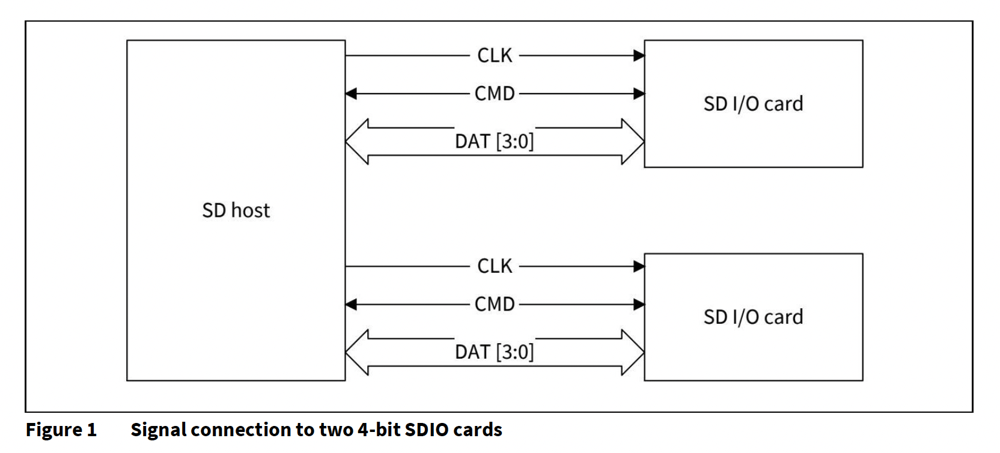
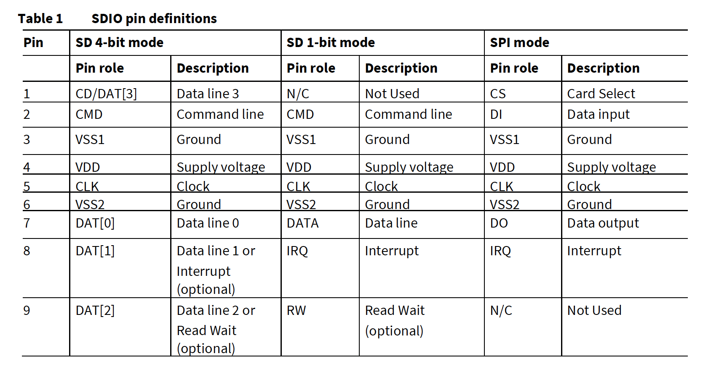
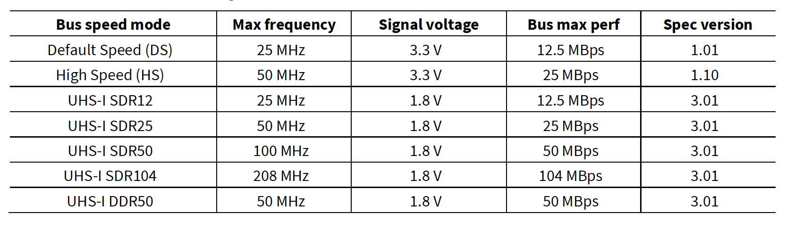
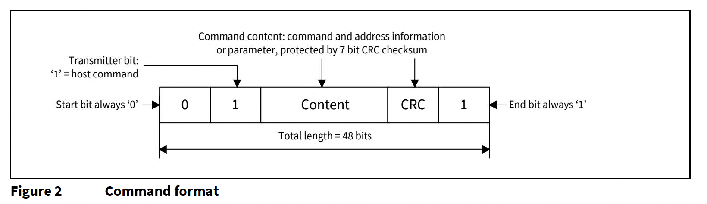
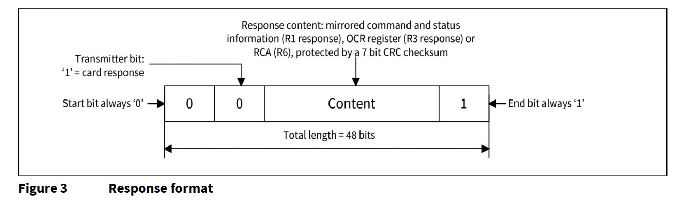
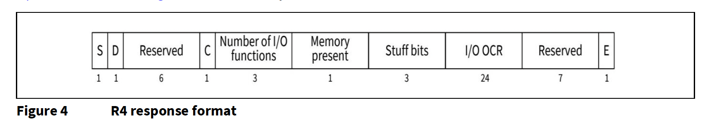
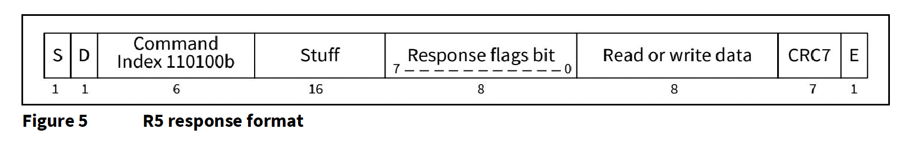
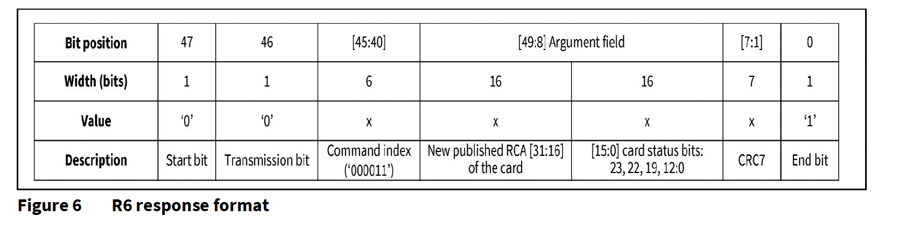
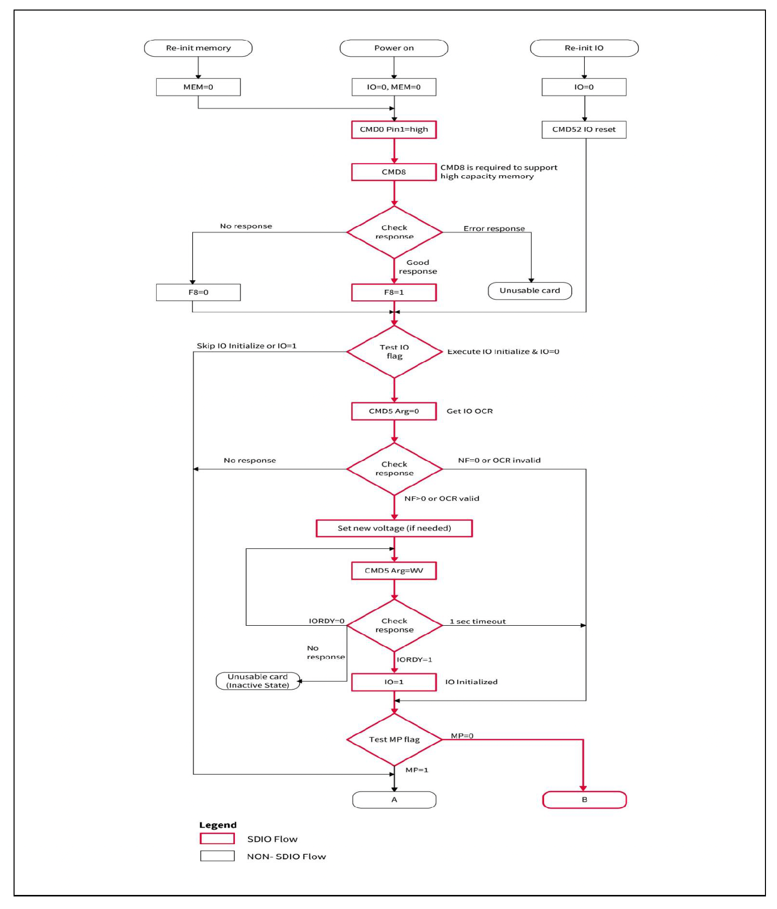
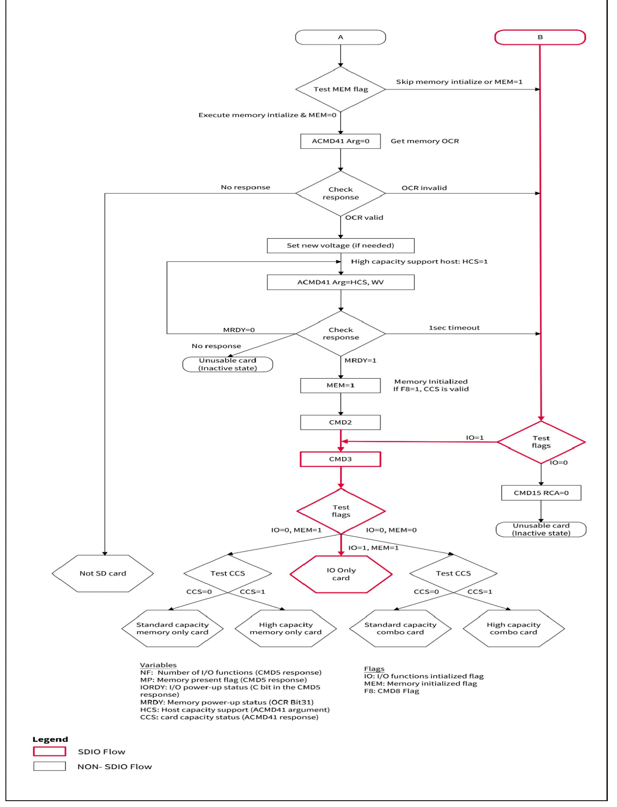

# SDIOプラットフォームサポートガイド : SDIOによるWLANの起動

## 本書の概要

### 範囲と目的

本書はSDIO (Secure Digital Input Output)の概要を示し、SDIOインタフェース上で
Wi‐Fiをお好みのホストで便利に設定できるよう支援します。また、アプリケーションに基づいて
設定することも可能です。

### 対象読者

本書は、主に選択した Linux ホストで Infineon® Wi‐Fi ソリューションをご利用の方を
対象としています。SDIOプロトコル、Linuxカーネルネットワーキング、Linuxホストプロセッサの
ブートフローに関する知識を有することが推奨されます。

### 文書構成

本書は3つのセクションに分かれています：

- 第1セクション（第1章）では、SDIOプロトコルについて説明し、以下のトピックを含みます:
    シグナルピン構造、動作モード、特定モードの最大バス速度、コマンド&レスポンス形式、
    SDIOプロトコルの初期化シーケンス、インバンドおよびOOB割り込みの利点と欠点
- 第2セクション（第2章〜第4章）では、SDIOインタフェース上のWLANの起動、ホスト（DTSファイル
    およびカーネル）で必要な変更、SDIOカード検出の検証、FMACドライバの構築とロード手順に
    ついて説明します。
- 最終セクション（第5章）には、デバッグ用のリファレンスセクションが含まれており、これにより
    ログの取得や成功したMMCドライバブートログの比較、そしてInitソースコードフローの取得が
    可能になります。

## 第１章 SDIO入門

SDIOインタフェースは既存のSDカード規格の拡張として設計されており、標準SDコントローラを使用して
ホストに異なる周辺機器を接続できるようにします。NVIDIA Jetson Xavierやi.MX8M Nano、
RaspberryPi 3/4 などのボード上で Wi‐Fi/Bluetooth® チップを接続するために広く使用されています。

### 1.1 SDIO信号ピン





### 1.2 SDIOバス速度



### 1.3 SDIOデバイス操作モード

- SPIモード（必須サポート）
    - このモードではDAT[1]が割り込みピンとして使用されます。
- 1ビットSDモード（必須サポート）
    - このモードでは、データはDAT [O]ピンでのみ転送されます。
    - このモードではDAT[1]は割り込みピンとして、DAT [2]は読み取り待機ピンとして使用されます。
- 4ビットSDモード（UHSモードでは必須、低速モードではオプション）
    - このモードでは、データは4つのデータピン（DAT [3:0]）すべてを使って転送されます。
    - このモードでは、割り込み専用ピンとしては使用できません。データ転送ラインとして
      利用されるからです。したがって、割り込み機能が必要な場合は割り込みを提供するために
      特別なタイミングが必要です。

4ビットSDモードはより多くのデータ転送を提供します。

### 1.4 SDIOプロトコル

SDバス上の通信は、スタートビットで開始され、ストップビットで終了するコマンドビットと
データビットストリームに基づいています。

コマンドは操作を開始するトークンです。コマンドはホストから単一のカード（アドレス指定コマンド）、
または、すべての接続カード（ブロードキャストコマンド）に送信されます。コマンドはCMDライン上で
シリアルに転送されます。

各コマンドトークンの前には開始ビット (0) が付き、後ろには終了ビット (1) が続きます。
総長は48ビットです。各トークンはCRCビットで保護されており、送信エラーを検出でき、操作を
繰り返すことが可能です。



レスポンスは以前に受信したコマンドへの応答として、アドレス指定カード、または（同期的に）
接続されたすべてのカードからホストへ送信されるトークンです。レスポンスはCMDライン上で
シリアルに転送されます。



#### 1.4.1 コマンド

**CMD5 (IO_SEND_OP_COND)**

- SDIOカード用のCMD5は、I/Oカードの電圧範囲について問い合わせます。
- CMD5 に対する通常の応答は R4 から読み取る必要があります。

**CMD52 (IO_RW_DIRECT)**

- このコマンドは、1つのコマンド/レスポンスペアのみを使用して1バイトを読み書きします。
  一般的な使用例は、I/0機能のレジスタまたはモニタのステータス値を初期化することです。
  このコマンドは単一のコマンド/レスポンスペアだけで済むので単一のI/Oレジスタを読み書き
  する最速の方法です。
- CMD52 の応答は R5 です。

**CMD53 (IO_RW_EXTENDED)**

- このデータ転送コマンドは、単一のコマンドで複数の I/O レジスタを読み書きするために
  使用されます。それは可能な限り最高の転送速度を提供します。
- CMD53への応答は R5 である必要があります。

**CMD3 (SEND_RELATIVE_ADDR)**

- このコマンドは、カードに新しい相対カードアドレス（RCA）の公開を要求するために使用されます。
- CMD3 のレスポンス（RCA）は R6 である必要があります。

#### 1.4.2 応答

**R4 (IOSEND_OP_COND Response)**

CMD5 を受信した SDIO カードは、SDIO 固有の応答で応答します。そのレスポンスには I/O OCR
(Operaton Condition register) やメモリの存在、I/O機能の数などが含まれます。



**R5 (IO_RW_DIRECT Response)**

CMD52/CMD53に対するSDIOカードの応答にはレスポンスフラグ（CMDのステータス）と
Read/Writeデータが含まれます。



**R6 (Published RCA Response)**

Argumentフィールドの上位16ビットは発行されたRCA番号に使用されます。



#### 1.4.3 データ

データはカードからホストに、または、ホストからカードに転送することができます。
データはデータラインにより転送されます。

### 1.5 SDIO初期化シーケンス




#### SDIOの初期化

- SDIO ホストは電源オン、または、CMD52のいずれかでI/Oを0にセットした後、初期化シーケンスの
  一部として CMD5, arg = 0 を送信します。すると、CMD5へのR4レスポンスで有効なOCR (Operation
  Condition Register）を受信し、カードの初期化を続行します。
- UHS-1をサポートするホストは、信号電圧を1.8Vに変更するために、CMD5の引数でを1.8Vに切り替える
  設定であるRequest(S18R)に1をセットして要求します。カードがUHS-1に対応しており、現在の信号
  電圧が3.3Vの場合、切り替えが行われた場合はR4レスポンスの1.8V Accepted(S18A)に1がセットされます。
  信号がすでに1.8 Vの場合、カードはS18AをOに設定し、ホストは現在の信号電圧を維持します。
- カードのI/O部分がCMD5を受け取っていない場合、それは非アクティブのままであり、CD5 以外の
  コマンドには応答しません。
- I/OホストがカードにCMD5を送信した場合、カードはR4で応答します。ホストはそのR4値を読み取り、
  利用可能なI/O機能の数を把握します。
- SDIOカードはI/O専用のカードとして検出されます。

### 1.6 割り込み機構 - インバンドまたはOOB

Wi‐FiデバイスはSDIO経由でホストプロセッサに接続されています。Wi‐Fiデバイスからホストへ割り込みを
ルーティングする方法は2つあります。

- インバンド機構はSDIO DATA1ラインを使用して割り込みを伝えます。
- OOB (Out-of-band) 機構は専用のGPIOピンを必要とします。ピンの多重化が確実に処理され、ピンが
  GPIOとしてのみ機能していることを確認してください。

アプリケーションに応じて、インバンドまたはOOBを選択することができます。最適な低電力数値を実現する
ためには、OOB信号伝達方式の使用を推奨します。このモードでは、パケットが受信された際にWLAN_HOST_WAKE
ラインにトリガーされた割り込みがない限り、SDIOバスはサスペンドモードになります。

- ホストプロセッサに予備のGPIOが利用できない場合は、DATA1ラインを割り込みとして再利用する
  インバンド割り込み方式を使用してください。これにより電力負担が増加するバスが停止されるのを防ぎます。

ホスト上のGPIOピンの可用性に基づき、適切なピンをOOB用に設定することができます。

## 第２章 SDIOによるWLANのk道に必要な変更点

### 2.1 DTS (Device Tree Source)ファイル

LinuxではDTSファイルはデバイスツリーソースファイルを指します。Linuxカーネルではデバイスや
システムのハードウェア構成およびプロパティを記述するために使用されます。

- OOB割り込み用GPIOピンの設定
    - i.MX8M Nanoホスト:

    以下は imx8mm-ea-ucom-kit_v3.dts における GPIO ピン構成です。

    ```bash
    interrupt-parent = <&gpio2>;
    interrupts = <9 IRQ_TYPE_LEVEl_LOW>;    /* M.2.ではWL_HOST_WAKE = GPIO2_IO09 アクティブLow */
    interrupt-names = "host-wake";
    ```

    - NVIDIA Jetson Xavierホスト:

    以下は itegra194-comms-p3668.dts における GPIO ピン構成です。

    ```bash
    interrupts = >TEGRA194_MAIN_GPIO(Q, 6) IRQF_TRIGGER_RISING>;    /* gpio = 422 (16*8) + 6 + 288) */
    ```

- SDIOバス速度の構成

    - i.MX8M Nanoホスト:

        SDIOバス速度モードの構成にはusdhc1ノードの"pinctrl-names"が使用されます。

        - "defaut"は50MHzのSDR25です。
        - "state_100mhz"はデバイスを100MHzのDDR50に構成します。
        - "state_200mhz"はデバイスを200MHzのSDR104に構成します。

        以下はSDIOバスをSDR104に構成しています。

        ```bash
        pinctrl-names = "state_200mhz";     /* SDR104に構成 */
        ```

    - Raspberry Piホスト:

        `/boot/config/txt`ファイルで次の変更を行います。

        sdio_overclockを使ってSDIOバス速度を構成します。

        ```bash
        dtoverlay-sdio, sdio_overclock=<val>
        ```

        以下はSDIOバスをSDR25に構成しています。

        ```bash
        sdio_overclock=50
        ```

    - NVIDIA Jetson Xavierホスト:

        uhx-maskを使って特定のSDIO速度モードに構成します。次のマスク値が使えます。

        - HS200モードにマスク: 0x20
        - HS400モードにマスク: 0x40
        - SDR104モードにマスク: 0x10
        - SDR50モードにマスク: 0x4

        以下はSDIOバスをSDR104に構成しています。

        ```bash
        uhs-mask = <0x08>;      /* SDR104に構成 */

i.MX8M NanoにおけるSDIOバス速度と割り込みの構成を行うための完全な変更は次のとおりです
(imx8mm-ea-ucom-ki_v3.dts)。

```bash
/* M.2 connector */
&usdhc1 {
    #address-cells = <1>;
    #size-cells = <0>;
    pinctrl-names = "default", "state_100mhz", "state_200mhz";
    pinctrl-0 = <&pinctrl_usdhc1>, <&pinctrl_usdhc1_gpio>;
    pinctrl-1 = <&pinctrl_usdhc1_100mhz>, <&pinctrl_usdhc1_gpio>;
    pinctrl-2 = <&pinctrl_usdhc1_200mhz>, <&pinctrl_usdhc1_gpio>;
    keep-power-in-suspend;
    non-removable;
    pm-ignore-notify;
    cap-power-off;
    mmc-pwrseq = <&usdhc1_pwrseq>;
    status = "okay";
    brcmi: bcrmf@1 {
        reg = <1>;
        compatible = "brcm,bcm4329-fmac";
        interrupt-parent = <&gpio2>;
        interrupus = <9 IRQ_TYPE_LEVEL_LOW>;    /* M.2.ではWL_HOST_WAKE = GPIO2_IO09 アクティブLow */
        interrupt-names = "host-wake";
    };
};
```

NVIDIA Jetson XavierボードにおけるSDIOバス速度と割り込みの構成を行うための完全な変更は次のとおりです
(tegra194-comms-p3668.dts)。

```bash
/*
 * Common include DTS file for CVM:P3668-0001 and CVB:P3449-0000 variants.
 *
 * Copyright (c) 2019, NVIDIA CORPORATION. All rights reserved.
 *
 * This program is free software; you can redistribute it and/or modify
 * it under the terms of the GNU General Public License as published by
 * the Free Software Foundation; version 2 of the License.
 *
 * This program is distributed in the hope that it will be useful, but WITHOUT
 * ANY WARRANTY; without even the implied warranty of MERCHANTABILITY or
 * FITNESS FOR A PARTICULAR PURPOSE. See the GNU General Public License for
 * more details.
 */

#include "dt-bindings/gpio/tegra194-gpio.h"

/ {
    wifi: wifi@1 {
        compatible = "brcm,bcm4329-fmac";
        wlreg_on-supply = <&wlreg_on>;
    };
};

&sdmmc3 {
    status = "okay";
    only-1-8-v;
    uhs-mask = <0x08>; /* SDR104 */
    wifi-host;
    nvidia,disable-rtpm;
    #address-cells = <1>;
    #size-cells = <0>;
    no-sd;
    pm-ignore-notify;
    keep-power-in-suspend;
    brcmfmac: bcrmfmac@1 {
        reg = <1>;
        compatible = "brcm,bcm4329-fmac";
        interrupt-parent = <&tegra_main_gpio>;
        interrupts = <TEGRA194_MAIN_GPIO(Q, 6) IRQF_TRIGGER_RISING>; /* gpio = 422 (16*8 + 6 + 288) */
        interrupt-names = "host-wake";
    };
};
```

NVIDIAJetson Xavierボードの電圧レベルの構成は次のとおりです。

```bash
regulator-min-microvolt = <1800000>;
regulator-max-microvolt = <1800000>;
```

NVIDIA Jetson Xavierボードにおける電圧の構成を行うための完全な変更は次のとおりです、

```diff
diff --git a/common/tegra194-fixed-regulator-p3509-0000-a00.dtsi
b/common/tegra194-fixed-regulator-p3509-0000-a00.dtsi
index 2a804b9..d4ecc42 100644
--- a/common/tegra194-fixed-regulator-p3509-0000-a00.dtsi
+++ b/common/tegra194-fixed-regulator-p3509-0000-a00.dtsi
@@ -16,6 +16,17 @@
/ {
        fixed-regulators {
+           //Fake regulator provides WL_REG_ON signal for wireless interface
+           wlreg_on: regulator@140 {
+           compatible = "regulator-fixed";
+           regulator-min-microvolt = <1800000>;
+           regulator-max-microvolt = <1800000>;
+           regulator-name = "wlreg_on";
+           //gpio = <TEGRA194_AON_GPIO(CC, 2) GPIO_ACTIVE_LOW>;
+           enable-active-high;
+           startup-delay-us = <100>;
+       };
+
        hdr40_vdd_3v3: p3509_vdd_3v3_cvb: regulator@101 {
        compatible = "regulator-fixed";
        reg = <101>;
diff --git a/common/tegra194-p3668-common.dtsi b/common/tegra194-p3668-
common.dtsi
index 36ebc4d..af643e1 100644
--- a/common/tegra194-p3668-common.dtsi
+++ b/common/tegra194-p3668-common.dtsi
@@ -24,6 +24,7 @@
#include "tegra194-power-tree-p3668.dtsi"
#include "tegra194-thermal-p3668.dtsi"
#include <t19x-common-platforms/tegra194-no-pll-aon-clock.dtsi>
+#include "tegra194-comms-p3668.dtsi"
/ {
        nvidia,fastboot-usb-vid = <0x0955>;
diff --git a/common/tegra194-power-tree-p3668.dtsi b/common/tegra194-powertree-
p3668.dtsi
index 8043234..ee8ad35 100644
--- a/common/tegra194-power-tree-p3668.dtsi
+++ b/common/tegra194-power-tree-p3668.dtsi
@@ -27,6 +27,10 @@
        vmmc-supply = <&p3668_vdd_sdmmc1_sw>;
};
+   sdhci@3440000 {
+       vmmc-supply = <&wlreg_on>;
+   };
+
    ether_qos@2490000 {
    vddio_sys_enet_bias-supply = <&battery_reg>;
    vddio_enet-supply = <&battery_reg>;
```

### 2.2 カーネル

- ホストカーネルのバージョンが4.11未満で、ホストプラットフォームにUHS-Iモードの
  サポートが追加されていない場合、SDIOをUHS-Iモードに設定するために以下のコード変更が
  必要です。デフォルトでUHS-1モードをサポートしているのはカーネルバージョンは4.11以上です。
- 電圧レベルを1.8 Vに切り替える変更が行われます。

```diff
diff --git a/drivers/mmc/core/core.c b/drivers/mmc/core/core.c
index bbf1505..e4ac0a6 100644
--- a/drivers/mmc/core/core.c
+++ b/drivers/mmc/core/core.c
@@ -1997,6 +1997,94 @@ int mmc_set_signal_voltage(struct mmc_host *host,
int signal_voltage, uint32_t ocr)
return err;
}
+int mmc_host_set_uhs_voltage(struct mmc_host *host, uint32_t ocr)
+{
+   uint32_t clock;
+
+   /*
+   * During a signal voltage level switch, the clock must be gated
+   * for 5 ms according to the SD spec
+   */
+   clock = host->ios.clock;
+   host->ios.clock = 0;
+   mmc_set_ios(host);
+
+   if (mmc_set_signal_voltage(host, MMC_SIGNAL_VOLTAGE_180, ocr))
+   r   eturn -EAGAIN;
+
+   /* Keep clock gated for at least 10 ms, though spec only says 5 ms */
+   mmc_delay(10);
+   host->ios.clock = clock;
+   mmc_set_ios(host);
+
+   return 0;
+}
+
+int mmc_set_uhs_voltage(struct mmc_host *host, uint32_t ocr)
+{
+   struct mmc_command cmd = {};
+   int err = 0;
+
+   /*
+   * If we cannot switch voltages, return failure so the caller
+   * can continue without UHS mode
+   */
+   if (host->ops->start_signal_voltage_switch)
+       return -EPERM;
+   if (!host->ops->card_busy)
+       pr_warn("%s: cannot verify signal voltage switch\n",
+       mmc_hostname(host));
+
+   cmd.opcode = SD_SWITCH_VOLTAGE;
+   cmd.arg = 0;
+   cmd.flags = MMC_RSP_R1 | MMC_CMD_AC;
+
+   err = mmc_wait_for_cmd(host, &cmd, 0);
+   if (err)
+       goto power_cycle;
+
+   if (!mmc_host_is_spi(host) && (cmd.resp[0] & R1_ERROR))
+       return -EIO;
+
+   /*
+   * The card should drive cmd and dat[0:3] low immediately
+   * after the response of cmd11, but wait 1 ms to be sure
+   */
+   mmc_delay(1);
+   if (host->ops->card_busy && host->ops->card_busy(host)) {
+       err = -EAGAIN;
+       goto power_cycle;
+   }
+
+   if (mmc_host_set_uhs_voltage(host, ocr)) {
+       /*
+       * Voltages may not have been switched, but we have already
+       * sent CMD11, so a power cycle is required anyway
+       */
+       err = -EAGAIN;
+       goto power_cycle;
+   }
+
+   /* Wait for at least 1 ms according to spec */
+   mmc_delay(1);
+
+   /*
+   * Failure to switch is indicated by the card holding
+   * dat[0:3] low
+   */
+   if (host->ops->card_busy && host->ops->card_busy(host))
+       err = -EAGAIN;
+
+   power_cycle:
+   if (err) {
+       pr_debug("%s: Signal voltage switch failed, "
+       "power cycling card\n", mmc_hostname(host));
+       mmc_power_cycle(host, ocr);
+   }
+
+   return err;
+}
+
/*
* Select timing parameters for host.
*/
diff --git a/drivers/mmc/core/core.h b/drivers/mmc/core/core.h
index c8f5172..b3fe27d 100644
--- a/drivers/mmc/core/core.h
+++ b/drivers/mmc/core/core.h
@@ -104,5 +104,6 @@ static inline void mmc_register_pm_notifier(struct mmc_host *host) { }
static inline void mmc_unregister_pm_notifier(struct mmc_host *host) { }
#endif
+int mmc_set_uhs_voltage(struct mmc_host *host, uint32_t ocr);
#endif
diff --git a/drivers/mmc/core/sdio.c b/drivers/mmc/core/sdio.c
index a2be7a3..333d519 100644
--- a/drivers/mmc/core/sdio.c
+++ b/drivers/mmc/core/sdio.c
@@ -636,9 +636,15 @@ static int mmc_sdio_init_card(struct mmc_host *host, uint32_t ocr,
* systems that claim 1.8v signalling in fact do not support
* it.
*/
-   if (!powered_resume && (rocr & ocr & R4_18V_PRESENT)) {
-       err = mmc_set_signal_voltage(host, MMC_SIGNAL_VOLTAGE_180,
-       ocr_card);
+   if (rocr & ocr & R4_18V_PRESENT) {
+       pr_err("mmc_sdio_init_card: powered_resume for Index: %d!!!!!\n",host->index);
+   if (host->index == 0) {
+       pr_err("mmc_sdio_init_card: Skipping 1.8 V setting for Index: %d!!!!!\n",host->index);
+       err = 0;
+   } else {
+       pr_err("mmc_sdio_init_card: Setting 1.8 V for Index: %d!!!!!\n",host->index);
+       err = mmc_set_uhs_voltage(host, ocr_card);
+   }
    if (err == -EAGAIN) {
        sdio_reset(host);
        mmc_go_idle(host);
@@ -1282,3 +1288,15 @@ int sdio_reset_comm(struct mmc_card *card)
    return err;
}
EXPORT_SYMBOL(sdio_reset_comm);
+
+void mmc_sdio_force_remove(struct mmc_host *host)
+{
+   mmc_sdio_remove(host);
+
+   mmc_claim_host(host);
+   mmc_detach_bus(host);
+   mmc_power_off(host);
+   mmc_release_host(host);
+}
+EXPORT_SYMBOL_GPL(mmc_sdio_force_remove);
+
diff --git a/drivers/mmc/host/sdhci-tegra.c b/drivers/mmc/host/sdhcitegra.c
index c7a6f85..94817f0 100644
--- a/drivers/mmc/host/sdhci-tegra.c
+++ b/drivers/mmc/host/sdhci-tegra.c
@@ -2212,6 +2212,7 @@ static void sdhci_delayed_detect(struct work_struct *work)
    pm_runtime_disable(mmc_dev(host->mmc));
}
+static struct mmc_host *wifi_mmc_host;
static int sdhci_tegra_probe(struct platform_device *pdev)
{
    const struct of_device_id *match;
@@ -2222,6 +2223,7 @@ static int sdhci_tegra_probe(struct platform_device *pdev)
    struct clk *clk;
    struct sdhci_tegra_clk_src_data *clk_src_data;
    int rc;
+   struct device_node *np = pdev->dev.of_node;
    match = of_match_device(sdhci_tegra_dt_match, &pdev->dev);
    if (!match)
@@ -2414,6 +2416,11 @@ static int sdhci_tegra_probe(struct platform_device
*pdev)
    if (tegra_host->en_periodic_calib)
    host->quirks2 |= SDHCI_QUIRK2_PERIODIC_CALIBRATION;
+   if (of_get_property(np, "wifi-host", NULL)) {
+       wifi_mmc_host = host->mmc;
+       dev_info(mmc_dev(host->mmc), "assigned as wifi host\n");
+   }
+
    schedule_delayed_work(&tegra_host->detect_delay,
    msecs_to_jiffies(tegra_host->boot_detect_delay));
    return 0;
@@ -2538,6 +2545,19 @@ static void tegra_sdhci_post_resume(struct
    sdhci_host *host)
    tegra_sdhci_post_init(host);
}
+void mmc_sdio_force_remove(struct mmc_host *host);
+void wifi_card_detect(bool on)
+{
+   WARN_ON(!wifi_mmc_host);
+   if (on) {
+       mmc_detect_change(wifi_mmc_host, 0);
+   } else {
+       if (wifi_mmc_host->card)
            mmc_sdio_force_remove(wifi_mmc_host);
+   }
+}
+EXPORT_SYMBOL_GPL(wifi_card_detect);
+
static int sdhci_tegra_card_detect(struct sdhci_host *host, bool req)
{
    struct sdhci_pltfm_host *pltfm_host = sdhci_priv(host);
```

## 第3章 SDIO検知の検証

起動時に、カーネルは適切なMMCスロットに構成されたモードでSDカードをSDIOとして検出できます。
以下のログはSDIOカード検出を確認しています。

たとえば、SDIOはSDR50用に構成されています。

> mmco：new ultra high speed SDR50 SDIO card at address 0001

SDIO構成の詳細は `/sys/kernel/debug/mmc0/ios` で見ることができます。

```bash
ifx@ifxhost:~$ sudo cat /sys/kernel/debug/mmc0/ios
clock: 100000000 Hz
actual clock: 97625098 Hz
vdd: 7 (1.65 - 1.95 V)
bus mode: 2 (push-pull)
chip select: 0 (don't care)
power mode: 2 (on)
bus width: 2 (4 bits)
timing spec: 5 (sd uhs SDR50)
signal voltage: 1 (1.80 V)
driver type: 0 (driver type B)
```

## 第4章 FMACのコンパイルとロード

### 4.1 FMACのコンパイル

この節ではFMACのバックポートドライバーソースのコンパイル方法について説明します。

Infineon® Technologiesの流通チャネル（FAE またはローカル営業担当者）または
[コミュニティページ](https://community.infineon.com/t5/Wi-Fi-Bluetooth-for-Linux/bd-p/WiFiBluetoothLinux/page/1)に
お問い合わせいただき、Infineon®のFMACバックポートドライバのソースファイルを取得して
ください。ビルドとデバッグについてはFMACリリースパッケージに含まれているWi‐Fiソフトウェア
ユーザーガイドとREADMEドキュメントを参照してください。

1. FMACバックポートソースパッケージを解凍する。

```bash
$ tar xvzf cypress-backports-v5.10.9-2022_0909-module-src.tar.gz
```
2. デバイスカーネルヘッダーへのパスを設定する。たとえば、Nvidia カーネルでは

```bash
§ export MY_KERNEL=/usr/src/linux-headers- 4.9.253-tegra-ubuntu18.04 aarch64/kernel-4.9/
```

3. defconfigs/bremfmacで指定したFMACドライバ構成から構成ファイル (.config) を生成する。

```bash
$ make KLIB=ŞMY_KERNEL KLIB_BUILD=ŞMY_KERNEL defconfig-brcmfmac
```

4. コンパイルしてカーネルモジュールを生成する。

```bash
$ make KLIB=$MY_KERNEL KLIB_BUILDE=$MY_KERNEL modukes
```

5. カーネルモジュールは以下のパスに作成されています。

```bash
./compat/compat.ko
./net/wireless/cfg80211.ko
./drivers/net/wireless/broadcom/brcm80211/brcmutil/brcmutil.ko
./drivers/net/wireless/broadcom/brcm80211/brcmfmac/brcmfmac.ko
```

### 4.2 FMACドライバとファームウェアのロード

次のコマンドを使ってWLAN FMACドライバとファームウェアをロードします。

```bash
sudo insmod compat.ko
sudo insmod cfg80211.ko
sudo insmod brcmutil.ko
sudo insmod brcmfmac.ko
```

FMACのビルドとロードに関する詳細についてはFMACリリースパッケージに含まれている
Wi-FiソフトウェアユーザガイドとREADMEドキュメントを参照してください。

## 第5章 デバッグとレファレンスログ

### 5.1 カーネルデバッグフラグ

カーネル設定ファイルで以下のデバッグ設定を有効にし、カーネルをビルドします.

- CONFIG_MMC_DEBUG
- CONFIG_DEBUG_FS
- CONFIG_BRCMDBG
- CONFIG_PRINTK

### 5.2 MMCドライバのブートログ

SDIO検知問題をデバッグするためのレファレンスログ

```bash
[ 2.402000] sdhci: Secure Digital Host Controller Interface driver
[ 2.408191] sdhci: Copyright(c) Pierre Ossman
[ 2.412601] sdhci-pltfm: SDHCI platform and OF driver helper
[ 2.418999] sdhci_pltfm_init
[ 2.422514] sdhci_alloc_host
[ 2.429422] sdhci: =========== REGISTER DUMP (mmc1) ===========
[ 2.435323] sdhci: Sys addr: 0x00000000 | Version: 0x00000002
[ 2.441163] sdhci: Blk size: 0x00000000 | Blk cnt: 0x00000001
[ 2.447026] sdhci: Argument: 0x00000000 | Trn mode: 0x00000000
[ 2.452884] sdhci: Present: 0x01f88088 | Host ctl: 0x00000000
[ 2.458723] sdhci: Power: 0x00000000 | Blk gap: 0x00000080
[ 2.464578] sdhci: Wake-up: 0x00000008 | Clock: 0x0000800f
[ 2.470416] sdhci: Timeout: 0x00000080 | Int stat: 0x00000000
[ 2.476269] sdhci: Int enab: 0x007f1003 | Sig enab: 0x007f1003
[ 2.482126] sdhci: AC12 err: 0x00000000 | Slot int: 0x00000302
[ 2.487962] sdhci: Caps: 0x07eb0000 | Caps_1: 0x0000b407
[ 2.493816] sdhci: Cmd: 0x00000000 | Max curr: 0x00ffffff
[ 2.499651] sdhci: Host ctl2: 0x00000000
[ 2.503594] sdhci: ADMA Err: 0x00000000 | ADMA Ptr: 0x00000000
[ 2.509428] sdhci: ===========================================
[ 2.571499] mmc_rescan
[ 2.574395] mmc1: mmc_rescan_try_freq: trying to init card at 400000 Hz
[ 2.581012] mmc1: mmc_rescan_try_freq: sdio_reset-> CMD52 performing sdio card reset
[ 2.589314] mmc1: SDHCI controller on 2194000.usdhc [2194000.usdhc] using ADMA
[ 2.590400] sdhci_pltfm_init
[ 2.590466] sdhci_alloc_host
[ 2.590602] sdhci-esdhc-imx 2198000.usdhc: Got WP GPIO
[ 2.590678] sdhci-esdhc-imx 2198000.usdhc: allocated mmc-pwrseq
[ 2.594113] sdhci: =========== REGISTER DUMP (mmc2) ===========
[ 2.594120] sdhci: Sys addr: 0x00000000 | Version: 0x00000002
[ 2.594123] sdhci: Blk size: 0x00000000 | Blk cnt: 0x00000001
[ 2.594127] sdhci: Argument: 0x00000000 | Trn mode: 0x00000000
[ 2.594131] sdhci: Present: 0x01f88088 | Host ctl: 0x00000000
[ 2.594135] sdhci: Power: 0x00000000 | Blk gap: 0x00000080
[ 2.594138] sdhci: Wake-up: 0x00000008 | Clock: 0x0000800f
[ 2.594142] sdhci: Timeout: 0x00000080 | Int stat: 0x00000000
[ 2.594146] sdhci: Int enab: 0x007f1003 | Sig enab: 0x007f1003
[ 2.594150] sdhci: AC12 err: 0x00000000 | Slot int: 0x00000302
[ 2.594154] sdhci: Caps: 0x07eb0000 | Caps_1: 0x0000b407
[ 2.594157] sdhci: Cmd: 0x00000000 | Max curr: 0x00ffffff
[ 2.594160] sdhci: Host ctl2: 0x00000000
[ 2.594163] sdhci: ADMA Err: 0x00000000 | ADMA Ptr: 0x00000000
[ 2.594165] sdhci: ===========================================
[ 2.662727] mmc2: SDHCI controller on 2198000.usdhc [2198000.usdhc] using ADMA
[ 2.663195] sdhci_pltfm_init
[ 2.663258] sdhci_alloc_host
[ 2.663366] sdhci-esdhc-imx 219c000.usdhc: could not get ultra high speed state, work on normal mode
[ 2.663394] sdhci-esdhc-imx 219c000.usdhc: Got CD GPIO
[ 2.663409] sdhci-esdhc-imx 219c000.usdhc: Got WP GPIO
[ 2.676496] sdhci: =========== REGISTER DUMP (mmc3) ===========
[ 2.676503] sdhci: Sys addr: 0x00000000 | Version: 0x00000002
[ 2.676507] sdhci: Blk size: 0x00000200 | Blk cnt: 0x00000001
[ 2.676511] sdhci: Argument: 0x00007e61 | Trn mode: 0x00000000
[ 2.676514] sdhci: Present: 0x01f88088 | Host ctl: 0x00000002
[ 2.676518] sdhci: Power: 0x00000000 | Blk gap: 0x00000080
[ 2.676522] sdhci: Wake-up: 0x00000008 | Clock: 0x0000011f
[ 2.676525] sdhci: Timeout: 0x0000008b | Int stat: 0x00000000
[ 2.676529] sdhci: Int enab: 0x007f1003 | Sig enab: 0x007f1003
[ 2.676532] sdhci: AC12 err: 0x00000000 | Slot int: 0x00000302
[ 2.676536] sdhci: Caps: 0x07eb0000 | Caps_1: 0x0000b407
[ 2.676540] sdhci: Cmd: 0x0000113a | Max curr: 0x00ffffff
[ 2.676542] sdhci: Host ctl2: 0x00000000
[ 2.676546] sdhci: ADMA Err: 0x00000000 | ADMA Ptr: 0x00000000
[ 2.676548] sdhci: ===========================================
[ 2.751732] mmc3: SDHCI controller on 219c000.usdhc [219c000.usdhc] using ADMA
[ 2.754128] galcore: clk_get 2d core clock failed, disable 2d/vg!
[ 2.754348] Galcore version 6.2.2.93313
[ 2.954162] mmc1: mmc_attach_sdio: sending CMD5 with arg=0 to get OCR info
[ 2.971521] mmc_rescan
[ 2.978853] mmc2: mmc_rescan_try_freq: trying to init card at 400000 Hz
[ 2.997160] mmc2: mmc_rescan_try_freq: sdio_reset-> CMD52 performing
sdio card reset
[ 3.012982] mmc1: mmc_rescan_try_freq: trying to init card at 300000 Hz
[ 3.052623] mmc2: mmc_attach_sdio: sending CMD5 with arg=0 to get OCR info
[ 3.060056] mmc_rescan
[ 3.063026] mmc3: mmc_rescan_try_freq: trying to init card at 400000 Hz
[ 3.069646] mmc3: mmc_rescan_try_freq: sdio_reset-> CMD52 performing sdio card reset
[ 3.077949] mmc1: mmc_rescan_try_freq: sdio_reset-> CMD52 performing sdio card reset
[ 3.091466] mmc1: mmc_attach_sdio: sending CMD5 with arg=0 to get OCR info
[ 3.091491] mmc2: mmc_select_voltage with ocr:30ffff00
[ 3.091496] mmc_select_voltage ocr:30ffff00
[ 3.091499] mmc2: selected voltage:00040000
[ 3.091504] mmc2: mmc_sdio_init_card: send CMD5 with Arg=<ocr voltage> ocr:00040000
[ 3.132346] mmc1: mmc_rescan_try_freq: trying to init card at 200000 Hz
[ 3.150800] mmc2: new high speed SDIO card at address 0001
[ 3.191470] mmc1: mmc_rescan_try_freq: sdio_reset-> CMD52 performing sdio card reset
[ 3.220161] mmc1: mmc_attach_sdio: sending CMD5 with arg=0 to get OCR info
[ 3.260454] mmc1: mmc_rescan_try_freq: trying to init card at 100000 Hz
[ 3.311459] mmc3: mmc_attach_sdio: sending CMD5 with arg=0 to get OCR info
[ 3.321465] mmc1: mmc_rescan_try_freq: sdio_reset-> CMD52 performing sdio card reset
[ 3.337293] mmc_select_voltage ocr:40ff8000
[ 3.373357] mmc1: mmc_attach_sdio: sending CMD5 with arg=0 to get OCR info
[ 3.406702] mmc3: new high speed SDHC card at address aaaa
[ 3.451528] mmcblk3: mmc3:aaaa SL08G 7.40 GiB
[ 3.457199] mmcblk3: p1 p2
```

### 5.3 初期化シーケンスコードフロー

｀Module: <kernel_src>/drivers/mmc/`

```bash
sdhci-pltfm.c
→ sdhci_pltfm_register(..)
    → sdhci_pltfm_init(..)
        → sdhci_alloc_host(..)
            → mmc_alloc_host(..)
                → mmc_rescan
    → mmc_rescan_try_freq(..)
        → sdio_reset(..) → **Sending CMD52**
            → mmc_attach_sdio(..)
                → mmc_send_io_op_cond(..) → **Sending CMD5 with Arg=0 to get OCR (Operation conditions register)**
                    → mmc_select_voltage(..)
                        → mmc_sdio_init_card(..)
                            → mmc_send_io_op_cond(..) → **Sending CMD5 with Arg=<selected voltage from OCR info>. SDIO is initialized.**
                                → [Reads OCR information further]:
                                    *Check if MEMORY capable card
                                    *Check if COMBO card(SD Memory + SDIO)
                                    *Check if UHS-I mode supported, then enable 1.8 V  signaling.
                                → [Reads CCCR Register]
                                → [Reads CIS tuples]
                                    → Check and enable the card to High speed or UHS based on voltage & signaling supported by the card.
                                → [Reads OCR to get Number of IO Functions]
                                    → Init functions and allocate memory
                                        → mmc_add_card(..) → **Add the MMC card to the driver model.**
                                        → mmc_add_card_debugfs(..) → **Add a debug filesystem if CONFIG_DEBUG_FS is enabled.**

                                        → device_add(..) → **Add the MMC device; Create filesystem; Notifies platform and filesystem about the addition of new device.**
```

### 5.4 SDIOバスアナライザ
