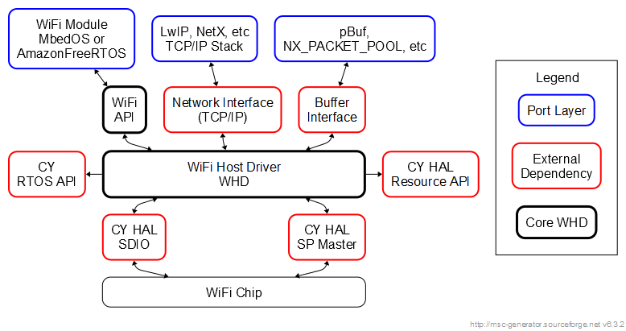
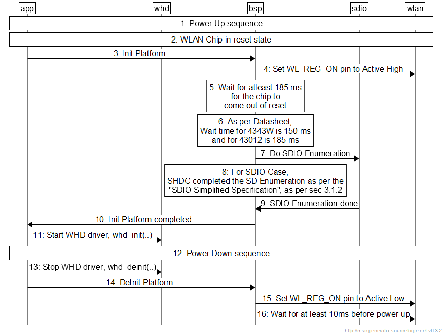
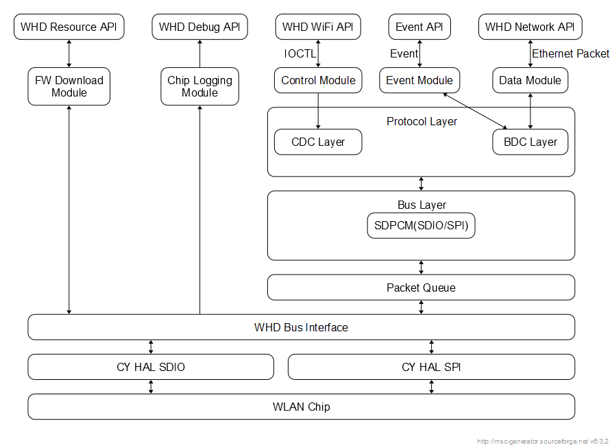
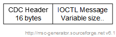
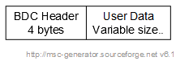
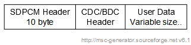
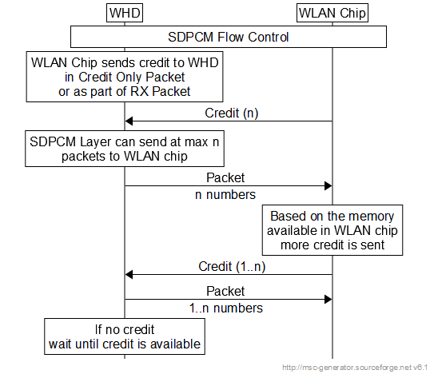
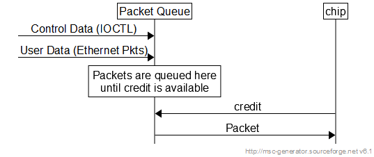

# [Wi-Fiホストドライバ (WHD) APIリファレンスガイド](https://infineon.github.io/wifi-host-driver/html/index.html)

## WHDの概要

WHD (Wi-Fi Host Driver)はInfineonのWLANチップと連携するための一連のAPIを提供する
独立した組み込み型Wi-Fiホストドライバです。WHDはMbed OSやAmazon FreeRTOSなどの
有名なIOTフレームワークを含む、あらゆる組み込みソフトウェア環境に簡単に接続可能な
独立したファームウェア製品です。したがって、WHDにはRTOSとTCP/IPネットワーク抽象化
レイヤ用のフックが含まれています。

WHDは以下のサービスを必要とします。

- **HAL**: プラットフォームでSDIO/SPIホストコントローラなどのハードウェアへの
  アクセスを提供する高レベル抽象化レイヤ
- **RTOS**: WHDは抽象化レイヤを使用してスレッドやセマフォなどのRTOS機能に
  アクセスします。これはInfineonのミドルウェアが使用しているのと同じインタフェースです。
- **BSP**: WHDはバスの定義を使用して、ボードがSDIO、SPI、M2Mのうちのどれを使用するかを
  指定します。この定義はInfineon BSPが仕様しているものと同じです。

## WHDの特徴

- Wi-Fi Station(STA)とAPモードをサポートしています。
- STAとAPインタフェースを並行操作をサポートします。
- WPA2、WPA3、オープンなど複数のセキュリティサポートが含まれています。
- 高度な電力管理を行うための機能を提供しています。
- 低電力オフロード(ARPフィルターとパケットフィルターを含む)をサポートします。
- 802.11nとWPA3に対するWFA事前認証サポートを含んでいます。

## WHDのフォルダ構成

- whd\src - コアWHDファイル
- whd\inc - WHD APIファイル
- whd\resources - WLANファームウェア
- whd.mk - _libwhd.a_ ライブラリを構築するための簡単なmakeファイル。

## WHDのアーキテクチャ

WHDは以下のアーキテクチャ図に示されているように3つの異なる構成要素から構成されています。
赤で強調表示されたブロックはWHDの外部依存関係であり、青色のブロックはポーティングレイヤ、
ブラックブロックはWHDコアです。



## WHDのポーティング

[この章は省略]

## WHDのパワーアップシーケンス

WHDを開始する前に、以下の手順を実行してください。

- WLANチップを32kHzのリファレンスクロックとスリープクロック入力ピンに接続します。
- WHDパワーアップシーケンスチャートに示されているWL_REG_ONピンを切り替えます。
    - WL_REG_ON ピンはすべてのWLANチップに対して同じ極性を持っています
    - SDIOを使用する場合、SHDCは「SDIO簡略化仕様」に従ってSDエヌメレーションを
      完了します。[SD仕様簡略版 Part E1](https://www.sdcard.org/downloads/pls/)と
      SDIO仕様簡略版のセクション3.1.2、図3-2のフローチャートを参照してください。



## WHDの動作モード

WHDには基本的に3つの動作モードがあります:

- WHD STAモード
- WHD APモード
- WHD STA+AP コンカレントモード

以下のコード例はSTA/APモードで実行するためのプログラムフローを示しています。

```c
############################################################
   ファイル whd.h
##############################################################
//抽象構造体
typedef struct whd_driver * whd_driver_t ;
typedef struct whd_interface * whd_interface_t ;

##############################################################
   ファイル app.c
################################################################
#include wh.h
app_start_whd()
{
    whd_driver_t whd_driver;
    whd_interface_t ifp;
    // 各Wi-Fiチップは各自のwhd_driverインスタンスを持つ。
    // 各whd_driverは動作と機能を定義するために　whd_interface_t構造体の
    // インスタンスを複数使用することができる。
    // WHD関数呼び出しのほとんどはこの構造体を入力として使用する。
    // デフォルトのプライマリインタフェースはWi-Fiチップの電源が入った時点で
    // 自動的に作成される。whd_wifi_on(...)。
    // プライマリインタフェースは STA/AP ロールニュートラルである。

    // WiFiチップごとにwhd_initを呼び出す(つまり、バススロットごとです。
    // 2つのSDIO Wifiチップは2回の呼び出しが必要)
    whd_init(&whd_driver, &whd_init_config_t, &whd_resource_source, &whd_buffer_funcs, &whd_netif_funcs);

    // SDIOまたはSPIのバスをアタッチする
    whd_bus_sdio_attach(whd_driver, &whd_sdio_cfg, &sdhc_obj);
    // または whd_bus_spi_attach(whd_driver, &whd_spi_cfg, &spi_obj);
    ...

    // Wi-Fiオン、ファームウェアのダウンロード、プライマリインタフェースの作成を行い
    // whd_interface_t を返す
    whd_wifi_on(whd_driver, &ifp);

    //11a。APに参加する - whd_driverではなく、whd_interface_t を使うことに注意
    whd_wifi_join(ifp, "AP SSID", WHD_SECURITY_OPEN, security_key, strlen(security_key), NULL);
    //今後、whd_ifpはSTAの役割を担う

    // または 11b。ここでAPを起動することもできる。すると、インタフェースはAPの
    // 役割を担うことになる
    //whd_wifi_init_ap(ifp ..)
    //whd_wifi_start_ap(ifp);

    // APから離れる
    whd_wifi_leave(ifp);
    // または AP を停止する
    //whd_wifi_stop_ap(ifp, ...);

    // Wi-Fiをオフにする
    whd_wifi_off(ifp);

    // SDIOまたはSPIのバスを切断する
    whd_bus_sdio_detach(whd_driver);
    // または whd_bus_spi_detach(whd_driver);

    // すべてのインターフェースを削除し、whdをde-initし、whd_driver メモリを解放する
    whd_deinit(ifp);
}
```

## WHDの内部情報

WHDは以下の図に示されているようにさまざまな内部モジュールから構成されています。
各モジュールは以下のセクションで説明されています。WHDの電源が入るとWLANバス固有の
初期化シーケンスが行われ、WLANチップの動作準備が整います。




### FWダウンロードモジュール

このモジュールはHALリソースAPIを使用して、WLANファームウェア、NVRAM、CLMファイルを
ダウンロードします。このモジュールはコントロールモジュールまたはデータパスモジュールの
サービスは使用しません。リソースを書き込むために「WHDバスインタフェース」に直接アクセス
します。ダウンロードが完了するとこのモジュールはWLANファームウェアを実行できます。

### WLANチップロギングモジュール

このモジュールはWHDデバッグAPIを使用してWLANチップログを取得する役割を果たします。

### コントロールモジュール

IOCTLはWLANチップへの制御アクセスを提供します。このモジュールはこれらのすべての
制御メッセージをWLANチップとの間でルーティングします。

### データモジュール

このモジュールはTCP/IPインタフェースで受信されたユーザデータを処理します。また、
WLANチップから受信したユーザデータを送信します。

### イベントモジュール

イベントモジュールはWLANチップから生成されたイベントを処理します。また、アプリケーションが
限られた数のイベントの登録や処理を行うための機能も公開します。

### プロトコルモジュール

WLANチップに送信されるパケットにはプロトコルヘッダーが必要です。プロトコルヘッダーには
2つのタイプがあります:

- CDC (IOCTLとIOVARなどの制御パケット用)
- BDC (ユーザデータまたはTCP/IPレイヤからのイーサネットパケット用)

プロトコルレイヤはバスに依存しておらず、SDIO/SPI/USBのいずれかが必要です。

- **CDCレイヤ** コントロールモジュールはこのCDCレイヤにメッセージを送信します。その際、
  CDCヘッダーと呼ばれる16バイトのヘッダーを追加します。ヘッダーの詳細を以下に示します。




```c
typedef struct
{
    uint32_t cmd;     // ioctl command value
    uint32_t len;     // lower 16: output buflen; upper 16: input buflen (excludes header)
    uint32_t flags;   // flag defns given in bcmcdc.h
    uint32_t status;  // status code returned from the device
} cdc_header_t;
```

- **BDCレイヤ** ユーザデータモジュールはBDCレイヤにメッセージを送信します。その際、
  BDCヘッダーと呼ばれ4バイトのヘッダーを追加します。ヘッダーの詳細を以下に示します。



```c
typedef struct
{
   uint8_t flags;        // Flags
   uint8_t priority;     // 802.1d Priority (low 3 bits)
   uint8_t flags2;
   uint8_t data_offset;  // Offset from end of BDC header to packet data, in 4-uint8_t words.
                         // Leaves room for optional headers.
} bdc_header_t;
```

### バスレイヤ

バスレイヤはバスレベルのプロトコル処理を提供します。SDIOの場合、SDPCMと呼ばれる
バスプロトコルが使用されます。

- **SDPCM - SDIO/SPIバスレイヤ** SDPCMレイヤーは以下の処理を行います。

    - WLANチップに送信されるパケットにシーケンス番号を追加する
    - WHDチップとWLANチップ間のフロー制御

  SDPCMレイヤは10バイト固定のヘッダーを追加し、以下のようなパケット形式をしています。



- **SDPCMヘッダー**

```c
typedef struct
{
  uint16_t  frametag[2];      // SDPCM packet size
  uint8_t sequence;           // Sequence number of pkt
  uint8_t channel_and_flags;  // IOCTL/IOVAR or User Data or Event
  uint8_t next_length;
  uint8_t header_length;      // Offset to BDC or CDC header
  uint8_t wireless_flow_control;
  uint8_t bus_data_credit;    // Credit from WLAN Chip
  uint8_t _reserved[2];
} sdpcm_header_t;
```

- **SDIO-SDPCMフロー制御** データをWLANに送信する前に、SDPCMレイヤはWLANチップからの
  クレジットを待たなければなりません。クレジットはWLANにより、SDPCMヘッダーパケット内か、
  RXユーザーデータパケット内のピギーバンク情報として送信されます。クレジットを受け取って
  いない場合、SDPCMレイヤはパケットを送信しないでください。



### パケットエンジン

このレイヤのリンクリストにすべてのコントロールとユーザデータがキューされます。
クレジットが利用可能になったら、このレイヤはデータをWLANチップに送信します。また、
このレイヤはWLANチップからRXデータをチェックし、TCP/IPインタフェースを介してデータを
ホストTCP/IPスタックに送信します。



### WHDバスインタフェース

このモジュールはパケットエンジン/sdpcmレイヤにバス独立のアクセス機能を提供します。
主にSDIO/SPI間で共通するアクセス機能を維持するために使用されます。

### SDIO HALインタフェース

SDIOホストコントローラハードウェアにアクセスするには、CY HALインタフェースを使用して
ください。これはWHDドライバには含まれません。

### SPI HALインタフェース

SPIホストコントローラハードウェアにアクセスするにはCY HALインターフェースを使用して
ください。これはWHDドライバには含まれません。

## WHD API

[この章は省略]
