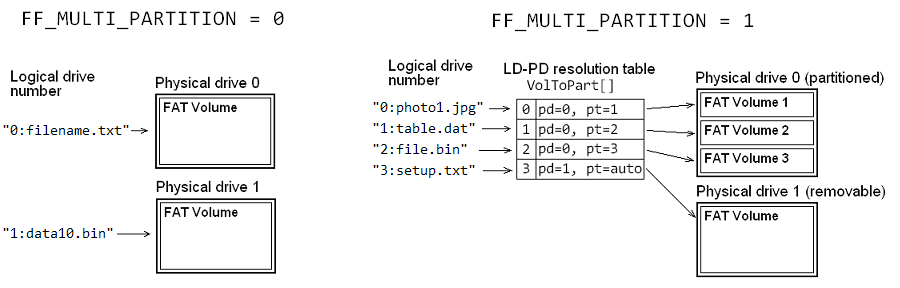

# FatFSライブラリ

## typedef

```c
typedef unsigned int    UINT;       /* int must be 16-bit or 32-bit */
typedef unsigned char   BYTE;       /* char must be 8-bit */
typedef uint16_t        WORD;       /* 16-bit unsigned integer */
typedef uint32_t        DWORD;      /* 32-bit unsigned integer */
typedef uint64_t        QWORD;      /* 64-bit unsigned integer */
typedef WORD            WCHAR;      /* UTF-16 character type */

/* ファイルサイズとLBA（論理ブロックアドレス）変数用の型 */
typedef DWORD FSIZE_t;
typedef DWORD LBA_t;

/* FatFS APIのpath名文字列用の型 (TCHAR) */
typedef char TCHAR;
```

## 主要な構造体

### FATFS構造体

```c
typedef struct {
    BYTE    fs_type;        /* ファルシステムタイプ (0: 未マウント) */
    BYTE    pdrv;           /* このFSがのっている物理ドライブ */
    BYTE    n_fats;         /* FATの数 (2) */
    BYTE    wflag;          /* win[] フラグ (b0: dirty) */
    BYTE    fsi_flag;       /* FSINFO フラグ (b7:disabled, b0:dirty) */
    WORD    id;             /* ボリュームマウントID */
    WORD    n_rootdir;      /* ルートディレクトリエントリの数 (FAT12/16) */
    WORD    csize;          /* クラスタサイズ [セクタ単位] */
    WCHAR*  lfnbuf;         /* LFN作業バッファ */
    DWORD   last_clst;      /* 最後に割り当てたクラスタ */
    DWORD   free_clst;      /* 空きクラスタの数 */
    DWORD   cdir;           /* カレントディレクトリの先頭クラスタ (0:root) */
    DWORD   n_fatent;       /* FATエントリの数 (クラスタ数 + 2) */
    DWORD   fsize;          /* FATのサイズ [セクタ単位] */
    LBA_t   volbase;        /* ボリュームの基底セクタ */
    LBA_t   fatbase;        /* FATの基底セクタ */
    LBA_t   dirbase;        /* ルートディレクトリの基底セクタ/クラスタ */
    LBA_t   database;       /* データの基底セクタ */
    LBA_t   winsect;        /* 現在win[]にセットされているセクタ */
    BYTE    win[FF_MAX_SS]; /* ディレクトリとFAT用のディスクアクセスウインドウ */
} FATFS;
```

### オブジェクト識別子構造体 (FFOBJID)

```c
typedef struct {
    FATFS*  fs;             /* このオブジェクトを保管しているボリュームへのポインタ */
    WORD    id;             /* 保管ボリュームのマウントID */
    BYTE    attr;           /* 属性 */
    BYTE    stat;           /* チェーン状態 (b1-0: 連続性, b2: サブディレクトリ拡張
                            /* (b1-0: =0:不連続, =2:連続, */
                            /*        =3:このセッションで断片化 */
    DWORD   sclust;         /* データの先頭クラスタ  (0:クラスタなし/root directory) */
    FSIZE_t objsize;        /* サイズ (sclust != 0の場合に有効) */
} FFOBJID;
```

### ファイルオブジェクト構造体 (FIL)

```c
typedef struct {
    FFOBJID obj;            /* オブジェクト識別子 */
    BYTE    flag;           /* ファイル状態フラグ */
    BYTE    err;            /* Abortフラグ (エラーコード) */
    FSIZE_t fptr;           /* ファイルのread/writeポインタ */
    DWORD   clust;          /* fpterのカレントクラスタ */
    LBA_t   sect;           /* 現在buf[]にセットされているセクタ (0:invalid) */
    LBA_t   dir_sect;       /* このディレクトリエントリのあるセクタの番号  */
    BYTE*   dir_ptr;        /* win[]内のこのディレクトリエントリへのポインタ  */
    DWORD*  cltbl;          /* クラスタリンクマップテーブルへのポインタ */
    BYTE    buf[FF_MAX_SS]; /* ファイルプライベートのデータread/writeウインドウ : セクタキャッシュとして使用 */
} FIL;
```

### ディレクトリオブジェクト構造体 (DIR)

```c
typedef struct {
    FFOBJID obj;            /* オブジェクト識別子 */
    DWORD   dptr;           /* カレントread/writeオフセット */
    DWORD   clust;          /* カレントクラスタ */
    LBA_t   sect;           /* カレントセクタ (0:Read operation has terminated) */
    BYTE*   dir;            /* win[]内のこのディレクトリエントリへのポインタ */
    BYTE    fn[12];         /* SFN (in/out) {body[8],ext[3],status[1]} */
    DWORD   blk_ofs;        /* 現在処理中のエントリブロックのオフセット (0xFFFFFFFF:Invalid) */
    const TCHAR* pat;       /* ファイル名マッチングパターンへのポインタ */
} DIR;
```

### ファイル情報構造体 (FILINFO)

```c
typedef struct {
    FSIZE_t fsize;                      /* ファイルサイズ */
    WORD    fdate;                      /* 変更日 */
    WORD    ftime;                      /* 変更時刻 */
    BYTE    fattrib;                    /* ファイル属性 */
    TCHAR   altname[FF_SFN_BUF + 1];    /* 代替ファイル名 */
    TCHAR   fname[FF_LFN_BUF + 1];      /* ファイル名 */
} FILINFO;
```

## フラグ定数定義

```c
/* DIR.fn[11]におく名前状態フラグ */
#define NSFLAG      11      /* 名前状態バイトのIndex */
#define NS_LOSS     0x01    /* 8.3 形式でない */
#define NS_LFN      0x02    /* LFNエントリの作成が必要 */
#define NS_LAST     0x04    /* 最後のセグメント */
#define NS_BODY     0x08    /* 小文字フラグ（本体） */
#define NS_EXT      0x10    /* 小文字フラグ（拡張子） */
#define NS_DOT      0x20    /* ドットエントリ */
#define NS_NOLFN    0x40    /* LFNは不要 */
#define NS_NONAME   0x80    /* 追跡しない */
```

## ff.cのstatic変数

```c
static FATFS* FatFs[FF_VOLUMES];    /* ファイルシステムオブジェクトへのポインタ (論理ドライブ) */
static WORD Fsid;                   /* ファイルシステムマウントID */
static BYTE CurrVol;                /* カレントドライブ */
static const BYTE DbcTbl[] = TBL_DC932;
```

## ff.c関数一覧

### api関数

```c
/* 論理ドライブをマウント/アンマウントする */
FRESULT f_mount(FATFS* fs, BYTE opt);

/* ファイルのOpenまたは作成 */
FRESULT f_open(FIL* fp, const TCHAR* path, BYTE mode);

/* ファイルを読み込む */
FRESULT f_read(FIL* fp, void* buff, UINT btr, UINT* br);

/* ファイルに書き込む */
FRESULT f_write(FIL* fp, const void* buff, UINT btw, UINT* bw);

/* ファイルを同期する */
FRESULT f_sync(FIL* fp);

/* ファイルを閉じる */
FRESULT f_close(FIL* fp);

/* カレントドライブを変更する */
FRESULT f_chdrive(const TCHAR* path);

/* カレントワーキングディレクトリを変更する */
FRESULT f_chdir(const TCHAR* path);

/* カレントワーキングディレクトリを取得する */
FRESULT f_getcwd(TCHAR* buff, UINT len);

/* ファイルのRead/Writeポインタをシークする */
FRESULT f_lseek(FIL* fp, FSIZE_t ofs);

/* ディレクトリオブジェクトを作成する */
FRESULT f_opendir(DIR* dp, const TCHAR* path);

/* ディレクトリを閉じる */
FRESULT f_closedir(DIR* dp);

/* ディレクトリエントリを順番に読み込む */
FRESULT f_readdir(DIR* dp, FILINFO* fno);

/* 次のファイルを見つける */
FRESULT f_findnext(DIR* dp, FILINFO* fno);

/* 最初のファイルを見つける */
FRESULT f_findfirst(DIR* dp, FILINFO* fno, const TCHAR* path, const TCHAR* pattern);

/* ファイルのstatを取得する */
FRESULT f_stat(const TCHAR* path, FILINFO* fno);

/* 空のクラスタ数を取得する */
FRESULT f_getfree(const TCHAR* path, DWORD* nclst, FATFS** fatfs);

/* ファイルを切り詰める */
FRESULT f_truncate(FIL* fp);

/* ファイル/ディレクトリを削除する */
FRESULT f_unlink(const TCHAR* path);

/* ディレクトリを作成する */
FRESULT f_mkdir(const TCHAR* path);

/* ファイル/ディレクトリを改名する */
FRESULT f_rename(const TCHAR* path_old, const TCHAR* path_new);

/* 属性を変更する */
FRESULT f_chmod(const TCHAR* path, BYTE attr, BYTE mask);

/* タイムスタンプを変更する */
FRESULT f_utime(const TCHAR* path, const FILINFO* fno);
```

### static関数

```c
/* 2バイトのリトルエンディアンワードのロード */
static WORD ld_word (const BYTE* ptr);

/* 4バイトのリトルエンディアンワードのロード */
static DWORD ld_dword (const BYTE* ptr);

/* 2バイトのリトルエンディアンワードのストア */
static void st_word (BYTE* ptr, WORD val);

/* 4バイトのリトルエンディアンワードのストア */
static void st_dword (BYTE* ptr, DWORD val);

/* バイトcは2バイトコードの1バイト目か* */
static int dbc_1st (BYTE c);

/* バイトcは2バイトコードの2バイト目か */
static int dbc_2nd (BYTE c);

/* UTF-8の1文字をUTF-16に変換して返す */
static DWORD tchar2uni (const TCHAR** str);

/* UTF-16の1文字をUTF-8に変換してbufに格納し、そのバイト数を返す */
static UINT put_utf (DWORD chr, TCHAR* buf, UINT szb);

/* FATFSオブジェクトのwin[]を書き戻す */
static FRESULT sync_window (FATFS* fs);

/*  FATFSオブジェクトのwin[]の内容をsectにする */
static FRESULT move_window (FATFS* fs, LBA_t sect);

/* ストレージ上のファイルシステムとデータを同期する */
static FRESULT sync_fs (FATFS* fs);

/* クラスタ番号から物理セクタ番号を取得する */
static LBA_t clst2sect (FATFS* fs, DWORD clst);

/* FAT アクセス - FATエントリの値を取得する */
static DWORD get_fat (FFOBJID* obj, DWORD clst);

/* FAT アクセス - FATエントリの値を変更する */
static FRESULT put_fat (FATFS* fs, DWORD clst, DWORD val);

/* FAT 処理 - クラスタチェーンを削除する */
static FRESULT remove_chain (FFOBJID* obj, DWORD clst, DWORD pclst);

/* FAT 処理 - チェーンを伸ばす、または新規チェーンを作成する */
static DWORD create_chain (FFOBJID* obj, DWORD clst);

/* FAT 処理 - リンクマップテーブルを使ってファイルオフセットをクラスタに変換する */
static DWORD clmt_clust (FIL* fp, FSIZE_t ofs);

/* ディレクトリ処理 - クラスタを0で埋める */
static FRESULT dir_clear (FATFS *fs, DWORD clst);

/* ディレクトリ処理 - ディレクトリエントリをセットする */
static FRESULT dir_sdi (DIR* dp, DWORD ofs);

/* ディレクトリ処理 - 次のディレクトリエントリに移動する */
static FRESULT dir_next (DIR* dp, int stretch);

/* ディレクトリ処理 - ディレクトリエントリのブロックを予約する */
static FRESULT dir_alloc (DIR* dp, UINT n_ent);

/* FAT: ディレクトリ処理 - ディレクトリエントリの先頭クラスタ番号を取得する */
static DWORD ld_clust (FATFS* fs, const BYTE* dir);

/* FAT: ディレクトリ処理 - ディレクトリエントリの先頭クラスタ番号をセットする */
static void st_clust (FATFS* fs, BYTE* dir, DWORD cl);

/* FAT-LFN: LFNエントリを使ってファイル名の一部(13文字）を比較する */
static int cmp_lfn (const WORD* lfnbuf, BYTE* dir);

/* FAT-LFN: LFNエントリからファイル名の一部(13文字)を取り出す */
static int pick_lfn (WORD* lfnbuf, BYTE* dir);

/* FAT-LFN: LFNエントリの1つのエントリを作成する */
static void put_lfn (const WORD* lfn, BYTE* dir, BYTE ord, BYTE sum);

/* FAT-LFN: 添字付きSFNを作成する */
static void gen_numname (BYTE* dst, const BYTE* src, const WORD* lfn, UINT seq);

/* FAT-LFN: SFNエントリのchecksumを計算する */
static BYTE sum_sfn (const BYTE* dir);

/* ディレクトリからオブジェクトを読み込む */
static FRESULT dir_read (DIR* dp, int vol);

/* ディレクトリ処理 - ディレクトリでオブジェクト(SFN,LFN)を見つける */
static FRESULT dir_find (DIR* dp);

/* ディレクトリエントリをディレクトリに登録する */
static FRESULT dir_register (DIR* dp);

/* ディレクトリからディレクトリエントリを削除する */
static FRESULT dir_remove (DIR* dp);

/* ディレクトリエントリからファイル情報を取得する */
static void get_fileinfo (DIR* dp, FILINFO* fno);

/* 1文字取得してポインタを進める */
static DWORD get_achar (const TCHAR** ptr);

/* パターンマッチングを行う */
static int pattern_match (const TCHAR* pat, const TCHAR* nam, UINT skip, UINT recur);

/* pathの最上位セグメントを取り出しディレクトリ形式でオブジェクト名を作成する */
static FRESULT create_name (DIR* dp, const TCHAR** path);

/* ファイルパスをたどる */
static FRESULT follow_path (DIR* dp, const TCHAR* path);

/* パス名から論理ドライブ番号を取得する */
static int get_ldnumber (const TCHAR** path);

/* ブートセクタをロードしてそれがFAT VBRであるかチェックする */
static UINT check_fs (FATFS* fs, LBA_t sect);

/* FATボリュームを探す */
static UINT find_volume (FATFS* fs, UINT part);

/* 論理ドライブ番号を決定して必要ならボリュームをマウントする */
static FRESULT mount_volume (const TCHAR** path, FATFS** rfs, BYTE mode);

/* ファイル/ディレクトリオブジェクトが有効か否かをチェックする */
static FRESULT validate (FFOBJID* obj, FATFS** rfs);
```

# [FatFS APIにおけるパス名](https://elm-chan.org/fsw/ff/doc/filename.html)

## パス名のフォーマット

FatFsモジュールにおけるパス名（オブジェクト（ファイルまたはサブディレクトリ）へのパス）の
フォーマットは次のようにDOS/Windowsのファイル名規則に似ています。

> [ドライブ番号:][/]ディレクトリ/ファイル

FatFsモジュールはロングファイル名（LFN）と8.3形式のファイル名（SFN）をサポートしています。
LFNは、`FF_USE_LFN >= 1` の場合に使用できます。サブディレクトリはDOS/Windows APIと
同様に `\` または `/` で区切られます。"`//animal///cat/`"のような重複した区切り文字と
末尾の区切り文字は無視されます。唯一の違いは、[論理ドライブ](https://elm-chan.org/fsw/ff/doc/filename.html#vol)
（FATボリューム）を指定するためのドライブプリフィックスが、DOS/Windows APIではアルファベット
（A-Z）＋コロンであるのに対し、数字（0-9）＋コロンである点です。論理ドライブ番号はアクセスする
FATボリュームを指定するための識別子です。ドライブプレフィックスが省略された場合、論理ドライブ番号は
**デフォルトドライブ**とされます。

制御文字（`\0` - `\x1F`）はパス名の終端として認識されます。LFN構成では、ファイル名の先頭
または途中に含まれる空白とドットはファイル名の一部として有効ですが、ファイル名の末尾にある空白と
ドットは無視され、切り捨てられます。非LFN構成では、空白はパス名の終端として認識されます。

デフォルトの構成（`FF_FS_RPATH == 0`）では、OSベースのファイルシステムにあるような
「カレントディレクトリ」という概念はありません。ボリューム上にあるすべてのオブジェクトは
常にルートディレクトリからの絶対パス名で指定されます。ドットディレクトリ名（"`.`"と"`..`"）は
使用できません。先頭にある区切り文字は無視されるため、存在しても省略してもかまいません。
デフォルトのドライブはドライブ 0 に固定されています。

相対パス機能が有効になっている場合（`FF_FS_RPATH >= 1`）、先頭に区切り文字が存在する場合、
指定されたパスはルートディレクトリから探索されます。存在しない場合はカレントディレクトリから
探索されます。パス名にはドットディレクトリ名（オブジェクトではなく、そのディレクトリまたは
親ディレクトリを指すもの）も使用できます。カレントディレクトリは [f_chdir](https://elm-chan.org/fsw/ff/doc/chdir.html)
関数によって設定され、デフォルトのドライブは[f_chdrive](https://elm-chan.org/fsw/ff/doc/chdrive.html)
関数によって設定された現在のドライブとなります。

| パス名 | FF_FS_RPATH == 0 | FF_FS_RPATH >= 1 |
|:------|:-----------------|:-----------------|
| file.txt | ドライブ 0のルートディレクトリにあるファイル | カレントドライブのカレントディレクトリにあるファイル |
| /file.txt | ドライブ 0のルートディレクトリにあるファイル | カレントドライブのルートディレクトリにあるファイル |
|  | ドライブ 0のルートディレクトリ | カレントドライブのカレントディレクトリ |
| / | ドライブ 0のルートディレクトリ | カレントドライブのルートディレクトリ |
| 2: | ドライブ 2のルートディレクトリ | ドライブ 2のカレントディレクトリ |
| 2:/ | ドライブ 2のルートディレクトリ | ドライブ 2のルートディレクトリ |
| 2:file.txt | ドライブ 1のルートディレクトリにあるファイル | ドライブ 2のカレントディレクトリにあるファイル |
| . | 不正なパス名 | このディレクトリ |
| .. | 不正なパス名 | 親ディレクトリ |
| ../file.txt | 不正なパス名 | 親ディレクトリのファイル |
| /.. | 不正なパス名 | ルートディレクトリ (トップレベルに固定) |

ドライブプレフィックスには事前定義した任意の文字列を指定できます。オプション `FF_STR_VOLUME_ID == 1` の
場合は任意の文字列のボリューム IDもドライブプレフィックスとして使用することができます。たとえば、
"**flash**:file1.txt", "**ram**:temp.dat", "**sd**:" などです。指定された文字列がいずれのボリューム
ID にも一致しない場合、この関数は `FR_INVALID_DRIVE` を返して失敗します。

`FF_STR_VOLUME_ID == 2` の場合はUnix形式のドライブプレフィックスを使用できます。たとえば、
"**/flash**/file1.txt", "**/ram**/temp.dat", "**/sd**" などです。先頭に区切り文字が
存在する場合はヘッダーボリューム ID を含む絶対パスとして扱われます。「カレントドライブのルートディレクトリ」や
「指定されたドライブのカレントディレクトリ」といった形式は使用できません。".." は、
"**/flash**/..**/ram**/foo.dat"のようなボリュームを横断することはできません。

## 使用可能な文字と大文字小文字の区別

一般的なFATファイルシステムではオブジェクト（ファイルまたはサブディレクトリ）名に使用可能な文字は
ASCIIの`0-9 A-Z ! # $ % & ' ( ) - @ ^ _ \` { } ~`と拡張文字の`\x80`から`\xFF`です。
LFN拡張機能を持つFATファイルシステムでは `+ , ; = [ ]`と空白文字、拡張文字（`U+000080`から
`U+10FFFF`）もオブジェクト名として使用可能です。空白文字とドットは、名前の末尾を除き、パス名の
どこにでも配置できます。末尾の空白文字とドットは無視されます。

FATファイルシステムではボリューム上のオブジェクト名について大文字と小文字を区別しません。FAT
ボリューム上のオブジェクト名は大文字と小文字を区別せずに比較されます。たとえば、3つのオブジェクト名
`file.txt`, `File.Txt`, `FILE.TXT`はFATファイルシステム上では同一とみなされます。これは拡張
文字にも適用されます。FATボリューム上にオブジェクトが作成されると大文字化された名前がSFNエントリに
記録され、LFN拡張機能が有効になっている場合はLFNエントリに元の名前が記録されます。

MS-DOSと中国語、日本語、韓国語対応のPC DOS (DOS/DBCS) では、拡張文字は大文字への変換を行わずに
SFNエントリに記録され、大文字と小文字を区別して比較されます。このため、DOS/DBCSシステムでボリューム上に
拡張文字を含むファイルを作成すると、Windowsシステムとの互換性に問題が生じます。したがって、これらの
システムで共有されるFATボリューム上ではDBCS拡張文字を含むオブジェクト名を使用すべきではありません。
FatFsはLFN構成においては拡張文字に対して大文字小文字を区別しない（Windows NT仕様）動作をします。
一方、DBCS構成の非LFN環境においてのみ、FatFsは拡張文字に対して大文字小文字を区別する（DOS/DBCS仕様）
動作をします。

## Unicode API

パス名は構成オプションに応じてANSI/OEMコードまたはUnicodeで入出力が行われます。パス名を指定する
引数の型は`TCHAR`として定義されています。デフォルトでは`char`の別名であり、パス名文字列に
使用されるコードセットは`FF_CODE_PAGE`によって指定されるANSI/OEMとなります。`FF_LFN_UNICODE`に
0以外の値が設定されると、`TCHAR`の型はUnicode文字列をサポートするための適切な型に切り替わります。
このオプションでUnicode APIが指定された場合、フル機能のLFN仕様がサポートされ、✝☪✡☸☭などのUnicode
固有の文字やBMPに含まれない任意の文字もパス名に使用できます。また、文字列I/O関数のデータ型や
エンコーディングにも影響します。リテラル文字列を定義するには`_T(s)`と`_TEXT(s)` マクロを使用して、
文字列を適切な型で指定できます。以下のコードはリテラル文字列を定義する例です。

```c
f_open(fp, "filename.txt", FA_READ);      /* ANSI/OEM string (char) */
f_open(fp, L"filename.txt", FA_READ);     /* UTF-16 string (WCHAR) */
f_open(fp, u8"filename.txt", FA_READ);    /* UTF-8 string (char) */
f_open(fp, U"filename.txt", FA_READ);     /* UTF-32 string (DWORD) */
f_open(fp, _T("filename.txt"), FA_READ);  /* Depends on FF_LFN_UNICODE (TCHAR) */
```

## ボリューム管理

デフォルトでは、各論理ドライブは、じドライブ番号を持つ物理ドライブに関連付けられます。物理ドライブ上の
FATボリュームはボリュームのマウント処理において検索されます。この処理ではブートセクタを読み取り、
SFD形式の場合はLBA 0から順に、MBRまたはGPT形式の場合は1番目のパーティション、2番目のパーティション、
3番目のパーティションという順で、FAT VBRであるかどうかを確認します。

マルチパーティション機能が有効（`FF_MULTI_PARTITION = 1`）な場合、個々の論理ドライブはボリューム
管理テーブル`VolToPart[]`で指定された任意のパーティションまたは物理ドライブに関連付けられます。
論理ドライブ番号と関連するパーティションまたはドライブのマッピングを解決するためにユーザはこのテーブルを
定義する必要があります。以下のコードは、ボリューム管理テーブルの例です。

```c
// 例: "0:", "1:", "2:"は物理ドライブ0（非リムーバブルドライブ)上の3つのパーティションに関連付ける。
//     "3:" は物理ドライブ1（リムーバブルドライブ）に関連付ける。

PARTITION VolToPart[FF_VOLUMES] = {
    {0, 1},     /* "0:" ==> pd#0上の1番目のパーティション */
    {0, 2},     /* "1:" ==> pd#0上の2番目のパーティション */
    {0, 3},     /* "2:" ==> pd#0上の3番目のパーティション */
    {1, 0}      /* "3:" ==> pd#1リムーバブルドライブ（自動検索）*/
};
```



マルチパーティション構成を有効にする際にはいくつかの注意点があります。

- 2つ以上のマウントパーティションをホストする物理ドライブは非リムーバブルである必要があります。
  あるいは、メディアを取り外す際にはそのドライブ上のすべてのボリュームをアンマウントする必要があります。
- `VolToPart[]`に変更を加える際は、変更を行う前に対応するボリュームをアンマウントする必要があります。
- MBR形式のドライブでは最大4つのプライマリパーティション（1-4）を指定できます。パーティション番号1は
  パーティションテーブルの最初のアイテムを指定し、パーティション番号2は2番目のアイテムを指定します。
  拡張パーティションの論理パーティション（5-）はサポートされていません。
- GPT形式のドライブでは、パーティション番号1はパーティションテーブルで最初に検出されたMicrosoft
  BDPを指定し、パーティション番号2は2番目に検出されたものを指定し、以下同様です。
- バージョン1703より前のWindows 10ではリムーバブルクラスの物理ドライブでは複数ボリュームはサポート
  されていません。ドライブ上で検出された最初のパーティションだけがマウントされます。Windows OSは
  非リムーバブルクラスの物理ドライブ上のSFDフォーマットをサポートしていません。
- 一部のシステムでは、オンボードストレージが非標準のパーティション形式で管理されており、各パーティションは
  `disk_*`関数において物理ドライブとしてマッピングされます。このようなシステムでは
  `FF_MULTI_PARTITION`は常に0として、`f_mkfs`で`FM_SFD`フラグを使用する必要があります。
- ボリューム管理に関する詳細については`f_mkfs`と`f_fdisk`の説明を参照してください。
